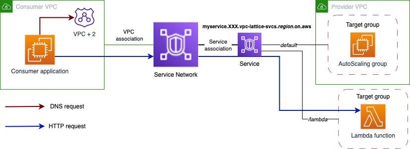

# Ingress Pattern for Amazon VPC Lattice

This code bundle builds a [Serverless](https://aws.amazon.com/serverless/) ingress solution, enabling [Amazon VPC Lattice](https://aws.amazon.com/vpc/lattice/) Services to be reached by consumers that reside outside of the Amazon Virtual Private Cloud ([VPC](https://docs.aws.amazon.com/vpc/latest/userguide/what-is-amazon-vpc.html)) both from trusted (on-premise or cross-Region) and non-trusted (external) locations.

## Background and solution considerations

The reason to build this ingress solution for VPC Lattice Services comes from the discovery and connectivity process. When you create a VPC Lattice Service, you are given a DNS name that represents it (globally unique and externally resolvable). However, from outside of the VPC, the DNS name resolves to a series of IP addresses in the **169.254.171.x/24** range (within the IPv4 Link-Local range 169.254/16 defined in [RFC3927](https://datatracker.ietf.org/doc/html/rfc3927)) and **fd00:ec2:80::/64** range (within the IPv6 Link-local range fe80::/10 defined in [RFC4291](https://datatracker.ietf.org/doc/html/rfc4291)). Link-Local addresses are not routable and are intended for devices that are connected to the same physical (or logical) link. When a consumer in a VPC resolves a Lattice Service to a Link-Local address, packets put on the wire to that address are intercepted by a special function in the Nitro card and routed to an ingress endpoint for the Lattice service. In the destination VPC, the inverse happens, and Lattice makes the necessary connections to the published Lattice Services.



This means that external consumers won't be able to consume a service exposed via VPC Lattice unless they are deployed in a VPC associated to the Service Network where they are associated. Unless you deploy a proxy solution within a Service Network associated VPC through which external consumers can connect - and that's what this solution is building!. With that out of the way, there are several architecture considerations to take to build the proxy ingress solution. In this particular case, we consider the following design elements and constraints:

* The proxy solution will provide layer 4 connectivity and layer 3 security. We are leaving all the layer 7 management to VPC Lattice. 
* VPC Lattice will provide authentication and authorization. The Service Network and/or Services should continue to function with authN/Z policies defined against them to ensure principals are who they say they are, and their actions are permitted.
* The proxy solution will make use of a fleet of lightweight open-source NGINX proxies running as ECS tasks. The entry point to this fleet will be either an internal or external NLB.
* The proxy solution will perform tcp-proxying for tls connections and pass through connections to VPC Lattice (avoids certificate management between the provider and ingress provider) reading sni fields for dynamic endpoint lookup.
* The proxy solution will perform http proxying for non tls connections by reading host header fields for dynamic endpoint lookup.
* The recommended and common pattern when creating a Service is to use custom domains. Therefore, now we can make use of several Route 53 hosted zones to have a different DNS resolution depending the location of the consumer (external users or the proxy solution).

## Solution Overview

This solution is deployed in two parts:

### Base Solution

The base solution copies the code in this repo into your own AWS account and enables you to iterate on it - your changes, as you make them will be saved to your own git compliant repo from which you can orchestrate deployment. The stack template sets up:

* An [Amazon Virtual Private Cloud](https://docs.aws.amazon.com/vpc/latest/userguide/what-is-amazon-vpc.html) across three [Availability Zones](https://aws.amazon.com/about-aws/global-infrastructure/regions_az/) with both public and private subnets across all three. In addition, supporting infrastructure such as:
    * [AWS PrivateLink VPC Endpoints (interface and gateway)](https://docs.aws.amazon.com/whitepapers/latest/aws-privatelink/what-are-vpc-endpoints.html) for the reaching AWS services privately (such as Amazon S3, Amazon Cloudwatch Logging and docker image repositories ([ECR](https://aws.amazon.com/ecr/)).
    * [Route Tables](https://docs.aws.amazon.com/vpc/latest/userguide/VPC_Route_Tables.html)
    * [Internet Gateway](https://docs.aws.amazon.com/vpc/latest/userguide/VPC_Internet_Gateway.html).
* The stack also creates the infrastructure that is needed to iterate on your code releases and deploys:
    * [AWS Code Commit](https://aws.amazon.com/codecommit/)repo for holding the code.
    * [Elastic Container Registry (ECR)](https://aws.amazon.com/ecr/)) for storing container images.
    * [AWS CodeBuild](https://aws.amazon.com/codebuild/) environment for building containers that run an open-source version of [NGINX](https://www.nginx.com/).
    * [AWS CodePipeline](https://aws.amazon.com/codepipeline/) for the orchestration of the solution build and delivery. Once deployed, your pipeline is ready for release.

**The following depicts the base solution:**


### ECS Solution

The pipeline deploys the following [template](/cloudformation/ecs/cluster.yaml) into your AWS account using CloudFormation. The stack template sets up:

* '**External**' access by deploying an internet-facing [Amazon Network Load Balancer](https://docs.aws.amazon.com/elasticloadbalancing/latest/network/introduction.html) that is deployed into the three public subnets and across the three Availability Zones.
* '**Internal**' access by deploying an internal Network Load Balancer that can only be reached from within the Amazon Virtual Private Cloud, via hybrid connections (such as [AWS Virtual Private Network](https://docs.aws.amazon.com/vpc/latest/userguide/vpn-connections.html) or [AWS Direct Connect](https://docs.aws.amazon.com/directconnect/latest/UserGuide/Welcome.html)), or via other VPCs in the same or other AWS Region (using [VPC peering](https://docs.aws.amazon.com/vpc/latest/peering/what-is-vpc-peering.html), [AWS Transit Gateway](https://aws.amazon.com/transit-gateway/), or [AWS Cloud WAN](https://aws.amazon.com/cloud-wan/)).
* Four [Target Groups](https://docs.aws.amazon.com/elasticloadbalancing/latest/network/load-balancer-target-groups.html) that are used to pass traffic to back-end compute instances. The stack template sets up an [Elastic Container Service Cluster](https://aws.amazon.com/ecs/), [ECS Task Definition](https://docs.aws.amazon.com/AmazonECS/latest/developerguide/task_definitions.html), and an [ECS Service](https://docs.aws.amazon.com/AmazonECS/latest/developerguide/ecs_services.html) using [Amazon Fargate](https://aws.amazon.com/fargate/) as the capacity provider. As Amazon Fargate tasks are deployed, they are mapped to the external and internal load balancer target groups which are bound to two 'tcp' listeners configured for ports 80 and 443. ECS Tasks therefore service both internal and external traffic.

**The following depicts the complete solution:**


## Security

This solution uses [PrivateLink Interface Endpoints](https://docs.aws.amazon.com/vpc/latest/privatelink/create-interface-endpoint.html) within the Private Subnets so that [Nat Gateways](https://docs.aws.amazon.com/vpc/latest/userguide/vpc-nat-gateway.html) are not required to reach the ECS Services. External access to this solution is only possible via the external or internal load balancers. NLBs currently cannot have [Security Groups](https://docs.aws.amazon.com/vpc/latest/userguide/vpc-security-groups.html) applied to them, however you can work with your AWS account team to enable this feature!

This solution does not require this advanced feature to provide layer-3 protection. The Target Groups for the load balancers have the `proxy_protocol_v2.enabled` attribute set such that the true IP source is passed to the NGINX targets. Within the [nginx.conf](/Dockerfiles/nginx/nginx.conf) the `Server{}` declaration for both the `Http` and `Stream` modules have their listeners set to accept the proxy protocol header `..listen % proxy_protocol..` By setting this, both modules can import the [ipcontrol.conf](/Dockerfiles/nginx/ipcontrol.conf) access list, which lists the source IP addresses that can connect to the proxy targets.

The following rule entries permit ALL RFC1918 networks to connect to the proxy service (including traffic from the load balancer nodes) whilst dropping everything else. Once you know where your traffic will be originating from outside of the VPC (which could include external clouds or networks), simply modify this file as appropriate with a suitable allow statement.

```
allow 192.168.0.0/16;
allow 172.16.0.0/12;
allow 10.0.0.0/8;
deny all;
```

## Proxy Configuration

The NGINX proxy image is built by CodeBuild each time the pipeline runs. To make changes to the [nginx.conf](/Dockerfiles/nginx/nginx.conf), simply modify the config in your CodeCommit repo and commit the changes back. The pipeline will run and create a newer `$latest` version in the ECR repo. To instantiate this, you need to `Update` your [ECS Fargate Service](https://docs.aws.amazon.com/AmazonECS/latest/developerguide/update-service-console-v2.html). As with changes to the `nginx.conf` file, changes to the `ipcontrol.conf` file will also create a pipeline run - by adjusting the values in this file the cotnainer image is rebuilt. After refreshing your ECS Service, your IP control values will be enforced.

The NGINX conf file is configured (as part of this repo) in the following way:

```
load_module /usr/lib64/nginx/modules/ngx_stream_module.so;
```

This loads the tcp streaming module for tls based passthrough.

The stream listener reads the SNI header to understand where the traffic is destined to, it uses the Amazon provided DNS endpoint at `169.254.169.253` for resolution which supplies a zonal response for the Lattice Service. The downstream endpoint is reached using the following directive `proxy_pass $ssl_preread_server_name:$server_port`

```
server {
    listen 443 proxy_protocol;
    proxy_pass $ssl_preread_server_name:$server_port;
    ssl_preread on;
    set_real_ip_from 192.168.0.0/16;
}
```
Proxy protocol is configured thus `listen 443 proxy_protocol`. This configuration trusts the NLB to pass **true** source IP information the NGINX proxy `set_real_ip_from 192.168.0.0/16` and enables NGINX to make affirmative decisions about the access it should permit based in this imported conf file:

```
include /etc/nginx/ipcontrol.conf;

```

Logging is output directly to CloudWatch Logs group for each Fargate Task:

```
log_format  basic   '$time_iso8601 $remote_addr $proxy_protocol_addr $proxy_protocol_port $protocol $server_port '
                '$status $upstream_addr $upstream_bytes_sent $upstream_bytes_received $session_time  $upstream_connect_time';

access_log  /var/log/nginx/stream_access.log basic if=$notAHealthCheck;
error_log   /var/log/nginx/stream_error.log crit;

```

This handy logic entry removes unnecessary health-check information from the logs:

```
map $bytes_received $notAHealthCheck {
    "~0"            0;
    default         1;
}
```
The http module is configured in a similar fashion to the stream module, except this proxies the http connection between the NLB and the Lattice Service -  passing the Host header and setting the upstream http version.

```
server {
    listen 80 proxy_protocol;
    location / {
        proxy_set_header Host $host;
        proxy_pass  http://$host:80;
        proxy_http_version 1.1;
    }
    set_real_ip_from 192.168.0.0/16;
    real_ip_header proxy_protocol;
}
```

## Deployment

Deployment of this solution is straight forward, you must:

1.  Deploy the baseline stack using the [stack template](/pipeline-stack.yml) in any [AWS Region](https://aws.amazon.com/about-aws/global-infrastructure/regions_az/) where you are publishing [Amazon VPC Lattice Services](https://docs.aws.amazon.com/vpc-lattice/latest/ug/services.html). More succinctly, you must deploy this stack as many times as you have distinct Amazon Lattice VPC Service Networks in a region, since there is a 1:1 mapping between Service Networks and Amazon VPCs.
   
2. After the baseline stack has been deployed, your CodePipeline will be waiting for you to release it. More accurately, you are required to 'enable a transition' from the **source** stage to the **build** stage. After you enable this transition, the pipeline will build the ECS infrastructure and deploy the load balancers and containers.

3. Following this you can now [associate the ingress VPC](https://docs.aws.amazon.com/vpc-lattice/latest/ug/service-network-associations.html) to the [Amazon VPC Lattice Service Network](https://docs.aws.amazon.com/vpc-lattice/latest/ug/service-networks.html) you want. To have the solution working and access your Lattice Services using the ingress solution, you will need to configure DNS resolution. 

### DNS resolution

Regardless of the pattern you want to follow (external, hybrid, or cross-Region) you need to create two [Route 53 Hosted Zones](https://docs.aws.amazon.com/Route53/latest/DeveloperGuide/hosted-zones-working-with.html):

* First, a Route 53 hosted zone to map the custom domain name into the NLB domain name (CNAME record).
    * If the NLB is public, you will need a Route 53 public hosted zone.
    * If the NLB is private, and the consumer is located on premises, you will need a private hosted zone. Depending the pattern you are following (hybrid or cross-region), this hosted zone needs to be associated to either the VPC where you have your hybrid DNS solution or the consumer VPC.
* Second, a Route 53 private hosted zone that maps the custom domain name to the Lattice Service generated domain name (CNAME record). This hosted zone needs to be associated to the ingress VPC. 

For multiple Lattice Services you don’t need new hosted zones, only new CNAME records.

In this repository you can find an [VPC Lattice Service example](./vpc-lattice_example/) that deploys a Service Network and a Service for you to test the solution. The example also creates the CNAME records explained above, but it does not create any Route 53 hosted zone (you need to provide them).

## Configuration and Testing

Once both parts of the solution have been deployed you should be able to perform a simple curl against your network load balancer's public DNS name, or your own dns alias records that you may have created to masquerade behind. If you have enabled your VPC Lattice Service or Service Network for authorisation, then you will need to sign your requests to the endpoint in the **same region** that you have deployed the stack in -  the following example using the **--aws-sigv4** switch with curl demonstrates how to do this:

    curl https://yourvpclatticeservice.name \
        --aws-sigv4 "aws:amz:%region%:vpc-lattice-svcs" \
        --user "$AWS_ACCESS_KEY_ID:$AWS_SECRET_ACCESS_KEY" \
        --header "x-amz-security-token:$AWS_SESSION_TOKEN" \
        --header "x-amz-content-sha256:UNSIGNED-PAYLOAD"
  
## Performance

A level of testing was performed against this solution. The specifics of the testing were as follows:

-   Region tested us-west-2
-   The Amazon VPC Lattice Service Published was [AWS LAMBDA](https://aws.amazon.com/lambda/)
    -   This was a simple LAMBDA, that had concurrency elevated to 3000 (from 1000 base)
-   External access via a three-zone AWS Network Load Balancer using DNS for round-robin on requests
-   AWS NLB was not configured for X-zone load balancing (in tests, this performed less well)
-   Three zonal AWS Fargate Tasks bound to the Network Load Balancer
    -   Each task had 2048 CPU units and 4096MB RAM

The testing harness used came from an AWS quick start solution that can be found [here](https://aws.amazon.com/solutions/implementations/distributed-load-testing-on-aws/) and additionally, the template can be found in this repo, [here](/load-test/distributed-load-testing-on-aws.template).

The following results show the harness performance, NLB performance, VPC Lattice performance and LAMBDA performance given 5000 remote users, generating ~3000 requests per second, with sustained access for 20 mins and a ramp-up time of 5 minutes.

**Harness Performance**


**ECS Performance**


**LAMBDA Performance**


**VPC Lattice Performance**


## Clean-up

Clean-up of this solution is straight-forward. First, start by removing the stack that was created by the CodePipeline - this can be identified in the CloudFormation console with the name **%basestackname%-%accountid%-ecs**. Once this has been removed, you can remove the parent stack that built the base stack. 

***NOTE*** The ECR repo and the S3 bucket will remain and should be removed manually.

## Security

See [CONTRIBUTING](CONTRIBUTING.md#security-issue-notifications) for more information.

## License

This library is licensed under the MIT-0 License. See the LICENSE file.

