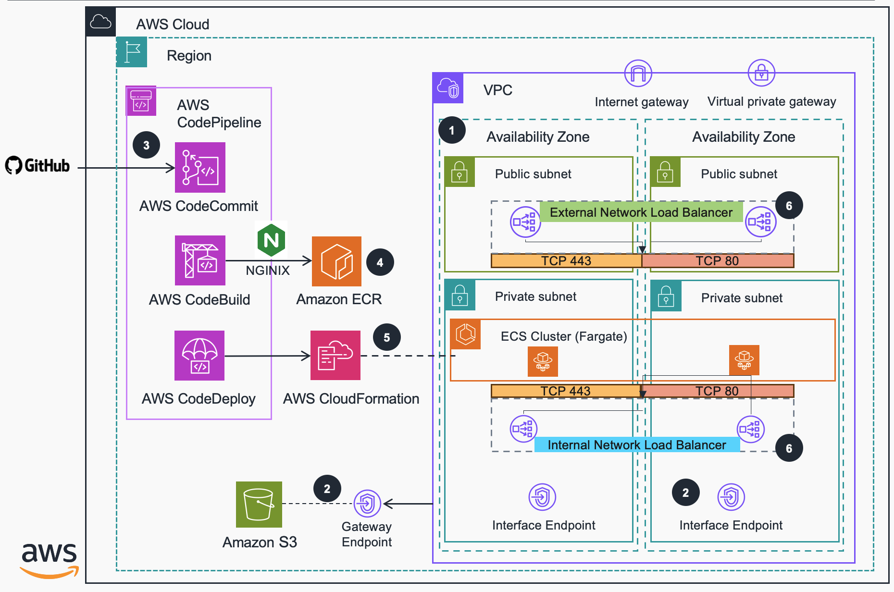
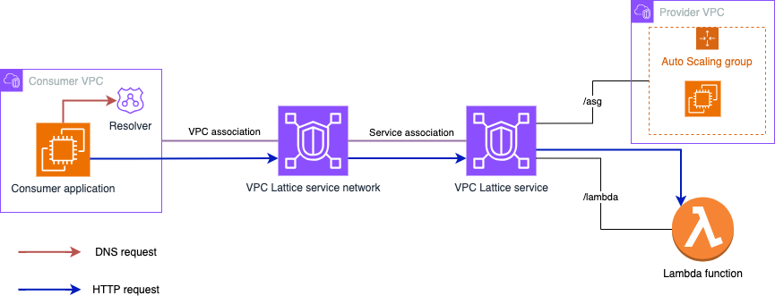
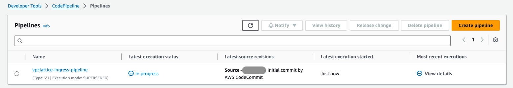
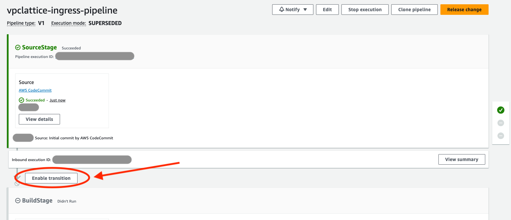

# Guidance for External Connectivity to Amazon VPC Lattice

This Guidance builds a [Serverless](https://aws.amazon.com/serverless/) proxy enabling [Amazon VPC Lattice](https://aws.amazon.com/vpc/lattice/) services to be reached by consumers that reside outside of the Amazon Virtual Private Cloud ([VPC](https://docs.aws.amazon.com/vpc/latest/userguide/what-is-amazon-vpc.html)) both from trusted (on-premise or cross-Region) and non-trusted (external) locations.



## Table of Content

1. [Overview](#overview)
    - [Cost](#cost)
2. [Prerequisites](#prerequisites)
    - [Operating System](#operating-system)
    - [Supported AWS Regions](#supported-aws-regions)
    - [VPC Lattice resources](#vpc-lattice-resources)
    - [DNS resolution configuration](#dns-resolution-configuration)
3. [Deployment Steps](#deployment-steps)
4. [Deployment Validation](#deployment-validation-required)
5. [Running the Guidance](#running-the-guidance-required)
6. [Next Steps](#next-steps)
    - [Security](#security)
    - [Proxy Configuration](#proxy-configuration)
    - [Scaling](#scaling)
    - [Logging](#logging)
    - [Performance](#performance)
7. [Cleanup](#cleanup-required)
8. [FAQ, known issues, additional considerations, and limitations](#faq-known-issues-additional-considerations-and-limitations-optional)
    - [Considerations](#considerations)
9. [License](#license)
10. [Contributing](#contributing)
11. [Authors](#authors)

## Overview

When you create a [VPC Lattice service](https://docs.aws.amazon.com/vpc-lattice/latest/ug/services.html), you are given a DNS name that represents it (globally unique and externally resolvable). However, from outside of the VPC, the DNS name resolves to a series of IP addresses in the **169.254.171.x/24** range (within the IPv4 Link-Local range 169.254/16 defined in [RFC3927](https://datatracker.ietf.org/doc/html/rfc3927)) and **fd00:ec2:80::/64** range (within the IPv6 Link-local range fe80::/10 defined in [RFC4291](https://datatracker.ietf.org/doc/html/rfc4291)). Link-Local addresses are not routable and are intended for devices that are connected to the same physical (or logical) link. When a consumer in a VPC resolves a VPC Lattice service to a Link-Local address, packets put on the wire to that address are intercepted by a special function in the [Nitro](https://aws.amazon.com/ec2/nitro/) card and routed to an ingress endpoint for the VPC Lattice service. In the destination VPC, the inverse happens, and VPC Lattice makes the necessary connections to the published VPC Lattice services.



This means that external applications won't be able to consume a service exposed via VPC Lattice unless they are deployed in a VPC associated to the [VPC Lattice service network](https://docs.aws.amazon.com/vpc-lattice/latest/ug/service-networks.html) where they are associated. Unless you deploy a proxy within a VPC associated to a VPC Lattice service network through which external consumers can connect - and that's what this Guidance builds!

### Cost

You are responsible for the cost of the AWS services used while running this Guidance. As of March 2024, the cost for running this Guidance with the default settings in the US East (N. Virginia) is approximately $200.52 per month. The following table provides a sample cost breakdown for deploying this Guidance with the default parameters in the US East (N. Virginia) Region for one month.

| AWS service  | Dimensions | Cost [USD] |
| ----------- | ------------ | ------------ |
| [AWS Fargate](https://aws.amazon.com/fargate/pricing/) | 3x2vCPUs & 3x4GBRAM | $ 30.08 month |
| [Network Load Balancer](https://aws.amazon.com/elasticloadbalancing/pricing/) | 1 NLCU & 2 NLBs (public and private communication) | $ 40.84 month |
| [VPC endpoints](https://aws.amazon.com/privatelink/pricing/) | 6 endpoint types in 3 Availability Zones | $ 129.60 month |

The following AWS services are within the [AWS Free Tier](https://aws.amazon.com/free/). Please check pricing pages to understand cost outside the Free Tier:

* [Amazon Elastic Container Registry](https://aws.amazon.com/ecr/pricing/)
* [AWS CodePipeline](https://aws.amazon.com/codepipeline/pricing/)
* [AWS CodeCommit](https://aws.amazon.com/codecommit/pricing/)

We recommend creating a [Budget](https://docs.aws.amazon.com/cost-management/latest/userguide/budgets-managing-costs.html) through [AWS Cost Explorer](https://aws.amazon.com/aws-cost-management/aws-cost-explorer/) to help manage costs. Prices are subject to change. For full details, refer to the pricing webpage for each AWS service used in this Guidance.

## Prerequisities

### Operating System

These deployment instructions are optimized to best work on Linux ARM64 instances. As we make use of AWS Fargate as serverless compute solution for containers, you don't need to worry about the instance infrastructure management.

### Supported AWS Regions

* This Guidance is meant to be built in those AWS Regions where Amazon VPC Lattice is supported. To get the list of supported Regions, check the [Amazon VPC Lattice endpoint and quotas](https://docs.aws.amazon.com/general/latest/gr/vpc-lattice-service.html) page.
* Check the supported Regions for the rest of AWS services used in this Guidance. However, consider VPC Lattice as the key one to check, since the rest of services have broader support:
    * The proxy is built using Amazon ECS on AWS Fargate. To get the supported Regions, check the [Amazon ECS documentation](https://docs.aws.amazon.com/AmazonECS/latest/developerguide/AWS_Fargate-Regions.html).
    * In addition, [Amazon Elastic Container Registry](https://aws.amazon.com/ecr/) (ECR) is used to store the container images - you can check supported Regions [here](https://docs.aws.amazon.com/general/latest/gr/ecr.html) page.
    * This Guidance uses a pipeline to build and deploy the proxy configuration in ECS. The following services are used:
        * [AWS CodeCommit](https://aws.amazon.com/codecommit/) - supported Regions [here](https://docs.aws.amazon.com/codecommit/latest/userguide/regions.html)
        * [AWS CodeBuild](https://aws.amazon.com/codebuild/) - supported Regions [here](https://docs.aws.amazon.com/general/latest/gr/codebuild.html)
        * [AWS CodePipeline](https://aws.amazon.com/codepipeline/) - supported Regions [here](https://docs.aws.amazon.com/general/latest/gr/codepipeline.html)

### VPC Lattice resources

* This Guidance provides access to VPC Lattice services, but **it does not create any VPC Lattice resources**. 
* When deploying the Guidance, a VPC Lattice service network ID is required so a [VPC Lattice VPC association](https://docs.aws.amazon.com/vpc-lattice/latest/ug/service-network-associations.html) is created.
* You can use the example in the *vpc-lattice_example* folder (`vpc-lattice_service.yaml`) to test end-to-end service consumption with the Guidance.

### DNS resolution configuration

Once the ingress VPC and proxy is created, and the VPC is associated to a VPC Lattice service network, DNS resolution has to be configured to allow connectivity from the external application to the proxy and from the proxy to VPC Lattice. Regardless of the pattern you want to follow (public, hybrid, or cross-Region) you need to create two [Amazon Route 53 Hosted Zones](https://docs.aws.amazon.com/Route53/latest/DeveloperGuide/hosted-zones-working-with.html).

* First, a Route 53 hosted zone to map the [VPC Lattice custom domain name](https://docs.aws.amazon.com/vpc-lattice/latest/ug/service-custom-domain-name.html) into the proxy's [Amazon Network Load Balancer](https://docs.aws.amazon.com/elasticloadbalancing/latest/network/introduction.html) (NLB) domain name (CNAME record).
    * If the NLB is public, you will need a Route 53 public hosted zone.
    * If the NLB is private, and the consumer is located on premises, you will need a private hosted zone. Depending the pattern you are following (hybrid or cross-region), this hosted zone needs to be associated to either the VPC where you have your hybrid DNS proxy or the consumer VPC.
* Second, a Route 53 private hosted zone that maps the custom domain name to the VPC Lattice service generated domain name (CNAME record). This hosted zone needs to be associated to the ingress VPC. 

For multiple VPC Lattice services you don’t need new hosted zones, only new CNAME records.

**NOTE** This Guidance does not create the hosted zones nor configures any DNS resolution. However, you can find an example in the *vpc-lattice_example* folder (`dns-resolution.yaml`).

For multiple VPC Lattice services you don’t need new hosted zones, only new CNAME records.

## Deployment Steps

To deploy this Guidance follow these steps:

1.  Deploy the baseline stack using the following [stack template](/guidance-stack.yml). More succinctly, you must deploy this stack as many times as you have distinct Amazon Lattice VPC service networks in a Region, since there is a 1:1 mapping between service networks and Amazon VPCs. 
    * A VPC Lattice service network ID is required to create the VPC association.
    * You can use the [baseline.sh](./scripts/baseline.sh) script to get the baseline stack deployed - simply make it executable with 'chmod +x'. You will need to include the service network ID in the script file. The script executes the following command:

```
aws cloudformation deploy --template-file ./guidance-stack.yml --stack-name guidance-vpclattice-pipeline --parameter-overrides VPCLatticeServiceNetwork=$VPCLATTICE_SERVICE_NETWORK --capabilities CAPABILITY_IAM
```

During deployment, the code in this repository is copied into your own AWS account and enables you to iterate on it - your changes, as you make them will be saved to your own git compliant repo from which you can orchestrate deployment. The stack template sets up:

* An [Amazon Virtual Private Cloud](https://docs.aws.amazon.com/vpc/latest/userguide/what-is-amazon-vpc.html) across three [Availability Zones](https://aws.amazon.com/about-aws/global-infrastructure/regions_az/) with both public and private subnets across all three. In addition, supporting infrastructure such as:
    * [AWS PrivateLink VPC Endpoints (interface and gateway)](https://docs.aws.amazon.com/whitepapers/latest/aws-privatelink/what-are-vpc-endpoints.html) for the reaching AWS services privately.
    * [Route Tables](https://docs.aws.amazon.com/vpc/latest/userguide/VPC_Route_Tables.html)
    * [Internet Gateway](https://docs.aws.amazon.com/vpc/latest/userguide/VPC_Internet_Gateway.html).
    * VPC Lattice VPC association between the created VPC and the service network provided.
* The stack also creates the infrastructure that is needed to iterate on your code releases and deploys:
    * AWS CodeCommit repository for holding the code.
    * Amazon ECR for storing container images.
    * AWS CodeBuild environment for building containers that run an open-source version of [NGINX](https://www.nginx.com/).
    * AWS CodePipeline for the orchestration of the Guidance's build and delivery. Once deployed, your pipeline is ready for release.

**NOTE** When deploying ECS for the first time, a ServiceLink Role is created for you. If you experience a stack deployment failure due to this Role not being created in time, clean the failed stack by deleting it then re-run the pipeline.
   
2. After the baseline stack has been deployed, your pipeline will be waiting for you to release it. More accurately, you are required to 'enable a transition' from the **source** stage to the **build** stage. 





Once you enable this transition, the pipeline deploys the following [template](/cloudformation/ecs/cluster.yaml) into your AWS account. The stack template sets up:

* '**External**' access by deploying an internet-facing NLB that is deployed into the three public subnets and across the three Availability Zones.
* '**Internal**' access by deploying an internal NLB that can only be reached from within the Amazon Virtual Private Cloud, via hybrid connections (such as [AWS Virtual Private Network](https://docs.aws.amazon.com/vpc/latest/userguide/vpn-connections.html) or [AWS Direct Connect](https://docs.aws.amazon.com/directconnect/latest/UserGuide/Welcome.html)), or via other VPCs in the same or other AWS Region (using [VPC peering](https://docs.aws.amazon.com/vpc/latest/peering/what-is-vpc-peering.html), [AWS Transit Gateway](https://aws.amazon.com/transit-gateway/), or [AWS Cloud WAN](https://aws.amazon.com/cloud-wan/)).
* Four [Target Groups](https://docs.aws.amazon.com/elasticloadbalancing/latest/network/load-balancer-target-groups.html) that are used to pass traffic to back-end compute instances. The stack template sets up an [Elastic Container Service Cluster](https://aws.amazon.com/ecs/), [ECS Task Definition](https://docs.aws.amazon.com/AmazonECS/latest/developerguide/task_definitions.html), and an [ECS Service](https://docs.aws.amazon.com/AmazonECS/latest/developerguide/ecs_services.html) using [AWS Fargate](https://aws.amazon.com/fargate/) as the capacity provider. As Fargate tasks are deployed, they are mapped to the external and internal load balancer target groups which are bound to two TCP listeners configured for ports 80 and 443. ECS Tasks therefore service both internal and external traffic.

3. To consume the VPC Lattice services, you will need to configure DNS resolution.

## Deployment Validation

* Open the AWS CloudFormation console and verify that the following stacks are deployed without errors: **guidance-vpclattice-pipeline** and **guidance-vpclattice-pipeline-%accountid%-ecs**.
* Verify that the following resources have been deployed successfully:
    * Move to the Amazon Elastic Container Service console. A cluster with the name **guidance-vpclattice-pipeline-%accountid%-ecs-NginxCluster-%random%** should have been created with 3 running tasks.
    * Move to the VPC console, and under *VPC Lattice - Service Networks* verify that the VPC created by this Guidance has been associated with your VPC Lattice service network. 

## Running the Guidance

Once the Guidance has been deployed you should be able to perform a simple curl against your network load balancer's public DNS name, or your own DNS alias records that you may have created to masquerade behind. 

```
curl https://yourvpclatticeservice.name
```

If you have enabled your VPC Lattice service or service network for authorisation, then you will need to sign your requests to the endpoint in the **same region** that you have deployed the stack in -  the following example using the **--aws-sigv4** switch with curl demonstrates how to do this:

```
curl https://yourvpclatticeservice.name \
    --aws-sigv4 "aws:amz:%region%:vpc-lattice-svcs" \
    --user "$AWS_ACCESS_KEY_ID:$AWS_SECRET_ACCESS_KEY" \
    --header "x-amz-security-token:$AWS_SESSION_TOKEN" \
    --header "x-amz-content-sha256:UNSIGNED-PAYLOAD"
```

You can test this by using the [setcredentials.sh](./scripts/setcredentials.sh) script and the [callendpoint.sh](./scripts/callendpoint.sh) script in this repo.

## Next Steps

### Security

This Guidance uses [PrivateLink Interface Endpoints](https://docs.aws.amazon.com/vpc/latest/privatelink/create-interface-endpoint.html) within the Private Subnets so that [NAT Gateways](https://docs.aws.amazon.com/vpc/latest/userguide/vpc-nat-gateway.html) are not required to reach the ECS Services. In addition, you can use [Security Groups](https://docs.aws.amazon.com/elasticloadbalancing/latest/network/load-balancer-security-groups.html) in the NLBs (for now, the Guidance doesn't make use of SGs and uses the NGINX layer3 protection mechanisms instead - detailed below)

The Target Groups for the load balancers have the `proxy_protocol_v2.enabled` attribute set such that the true IP source is passed to the NGINX targets. Within the [nginx.conf](/Dockerfiles/nginx/nginx.conf) the `Server{}` declaration for both the `Http` and `Stream` modules have their listeners set to accept the proxy protocol header `..listen % proxy_protocol..` By setting this, both modules can import the [ipcontrol.conf](/Dockerfiles/nginx/ipcontrol.conf) access list, which lists the source IP addresses that can connect to the proxy targets.

The following rule entries permit ALL RFC1918 networks to connect to the proxy service (including traffic from the load balancer nodes) whilst dropping everything else. Once you know where your traffic will be originating from outside of the VPC (which could include external clouds or networks), simply modify this file as appropriate with a suitable allow statement.

```
allow 192.168.0.0/16;
allow 172.16.0.0/12;
allow 10.0.0.0/8;
deny all;
```

### Proxy Configuration

The NGINX proxy image is built by CodeBuild each time the pipeline runs. To make changes to the [nginx.conf](/Dockerfiles/nginx/nginx.conf), simply modify the config in your CodeCommit repo and commit the changes back. The pipeline will run and create a newer `$latest` version in the ECR repo. To instantiate this, you need to `Update` your [ECS Fargate Service](https://docs.aws.amazon.com/AmazonECS/latest/developerguide/update-service-console-v2.html). As with changes to the `nginx.conf` file, changes to the `ipcontrol.conf` file will also create a pipeline run - by adjusting the values in this file the cotnainer image is rebuilt. After refreshing your ECS Service, your IP control values will be enforced.

The NGINX conf file is configured (as part of this repo) in the following way:

```
load_module /usr/lib64/nginx/modules/ngx_stream_module.so;
```

This loads the tcp streaming module for tls based passthrough.

The stream listener reads the SNI header to understand where the traffic is destined to, it uses the Amazon provided DNS endpoint at `169.254.169.253` for resolution which supplies a zonal response for the Lattice Service. The downstream endpoint is reached using the following directive `proxy_pass $ssl_preread_server_name:$server_port`

```
server {
    listen 443 proxy_protocol;
    proxy_pass $ssl_preread_server_name:$server_port;
    ssl_preread on;
    set_real_ip_from 192.168.0.0/16;
}
```
Proxy protocol is configured thus `listen 443 proxy_protocol`. This configuration trusts the NLB to pass **true** source IP information the NGINX proxy `set_real_ip_from 192.168.0.0/16` and enables NGINX to make affirmative decisions about the access it should permit based in this imported conf file:

```
include /etc/nginx/ipcontrol.conf;

```

Logging is output directly to CloudWatch Logs group for each Fargate Task:

```
log_format  basic   '$time_iso8601 $remote_addr $proxy_protocol_addr $proxy_protocol_port $protocol $server_port '
                '$status $upstream_addr $upstream_bytes_sent $upstream_bytes_received $session_time  $upstream_connect_time';

access_log  /var/log/nginx/stream_access.log basic if=$notAHealthCheck;
error_log   /var/log/nginx/stream_error.log crit;

```

This handy logic entry removes unnecessary health-check information from the logs:

```
map $bytes_received $notAHealthCheck {
    "~0"            0;
    default         1;
}
```
The http module is configured in a similar fashion to the stream module, except this proxies the http connection between the NLB and the Lattice Service -  passing the Host header and setting the upstream http version.

```
server {
    listen 80 proxy_protocol;
    location / {
        proxy_set_header Host $host;
        proxy_pass  http://$host:80;
        proxy_http_version 1.1;
    }
    set_real_ip_from 192.168.0.0/16;
    real_ip_header proxy_protocol;
}
```

### Scaling

This Guidance has been built on the assumption that it should automatically scale and contract using average CPU metrics for the ECS Service as the dimension. During load-testing, it was evident that the Guidance was CPU bound as the load increased, based on the specifications of the task sizes that were chosen - some independent measurement statistics can be found [here](https://www.stormforge.io/blog/aws-fargate-network-performance/). You can adjust this by using a metric that best suits your application profile and load simply by modifying the [cluster.yaml](/cloudformation/ecs/cluster.yaml) template. 

Using [Application Autoscaling](https://docs.aws.amazon.com/autoscaling/application/userguide/services-that-can-integrate-ecs.html) with ECS, you can use both TargetTrackingScaling and StepScaling. This Guidance uses TargetTrackingScaling and a `PredefinedMetricType` of `ECSServiceAverageCPUUtilization` - but you can write your own metrics, publish them to CloudWatch and then reference these using a `CustomizedMetricSpecification`, more details on that [here](https://docs.aws.amazon.com/AWSCloudFormation/latest/UserGuide/aws-properties-applicationautoscaling-scalingpolicy-targettrackingscalingpolicyconfiguration.html#cfn-applicationautoscaling-scalingpolicy-targettrackingscalingpolicyconfiguration-customizedmetricspecification)

This Guidance assumes that you want to scale when the service reaches an average cpu utilisation of `70%` - to modify this, simply adjust the template.

```
  NginxScalableTarget:
    Type: AWS::ApplicationAutoScaling::ScalableTarget
    Properties: 
      MaxCapacity: 9
      MinCapacity: 3
```

```
  NginxScalingPolicy:
    Type: AWS::ApplicationAutoScaling::ScalingPolicy
    Properties: 
      .....
      TargetTrackingScalingPolicyConfiguration:
        TargetValue: 70.0
        ScaleInCooldown: 60
        ScaleOutCooldown: 60
```

### Logging

This Guidance makes use of [Container Insights](https://docs.aws.amazon.com/AmazonCloudWatch/latest/monitoring/ContainerInsights.html) for capturing performance data for the ECS service. This data is written into Amazon CloudWatch Logs and can be accessed from the ECS or CloudWatch console.


### Performance

A level of testing was performed against the Guidance. The specifics of the testing were as follows:

* Region tested us-west-2
* The Amazon VPC Lattice Service Published was [AWS Lambda](https://aws.amazon.com/lambda/)
    * This was a simple Lambda function, that had concurrency elevated to 3000 (from 1000 base)
* External access via a three-zone AWS Network Load Balancer using DNS for round-robin on requests
* AWS NLB was not configured for X-zone load balancing (in tests, this performed less well)
* Three zonal AWS Fargate Tasks bound to the Network Load Balancer
    * Each task had 2048 CPU units and 4096MB RAM

The testing harness used came from an AWS Solution that can be found [here](https://aws.amazon.com/solutions/implementations/distributed-load-testing-on-aws/) and additionally, the template can be found in this repo, [here](/load-test/distributed-load-testing-on-aws.template).

The following results show the harness performance, NLB performance, VPC Lattice performance and LAMBDA performance given 5000 remote users, generating ~3000 requests per second, with sustained access for 20 mins and a ramp-up time of 5 minutes.

**Harness Performance**


**ECS Performance**


**LAMBDA Performance**


**VPC Lattice Performance**


## Cleanup

1. Remove the stack that was created by AWS CodePipeline - this can be identified in the AWS CloudFormation console with the name **%basestackname%-%accountid%-ecs**. 
2. Once this has been removed, you can remove the parent stack that built the base stack.

**NOTE** The ECR repo and the S3 bucket will remain and should be removed manually.

## FAQ, known issues, additional considerations, and limitations

### Considerations

For this Guidance, we consider the following design elements and constraints:

* The Guidance will provide layer 4 connectivity and layer 3 security. We are leaving all the layer 7 management to VPC Lattice. 
* VPC Lattice will provide authentication and authorization. The VPC Lattice service network and/or services should continue to function with authN/Z policies defined against them to ensure principals are who they say they are, and their actions are permitted.
* The Guidance will make use of a fleet of lightweight open-source NGINX proxies running as ECS tasks. The entry point to this fleet will be either an internal or external NLB.
* The Guidance will perform TCP-proxying for TLS connections and pass through connections to VPC Lattice (avoids certificate management between the provider and ingress provider) reading SNI fields for dynamic endpoint lookup.
* The Guidance will perform HTTP proxying for non TLS connections by reading host header fields for dynamic endpoint lookup.
* The recommended and common pattern when creating a VPC Lattice service is to use custom domains. Therefore, now we can make use of several Route 53 hosted zones to have a different DNS resolution depending the location of the consumer (external users or the proxy).

## License

This library is licensed under the MIT-0 License. See the [LICENSE](LICENSE) file.

## Contributing

See [CONTRIBUTING](CONTRIBUTING.md) for more information.

## Authors

* Adam Palmer, Senior Network Specialist Solutions Architect, AWS
* Pablo Sánchez Carmona, Network Specialist Solutions Architect, AWS